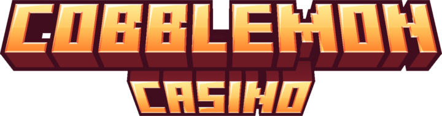

# Cobblemon Casino

Cobblemon Casino is a NeoForge 1.21.1 Cobblemon addon that adds casino-themed blocks, items, gacha machines, slot machines, blackjack, economy helpers, and casino worker villagers.

## Credits

Cobblemon Casino is maintained by narrnouille and is based on the original Casino Rocket mod by AndresPR.

## Target Versions

- Minecraft: `1.21.1`
- NeoForge: `21.1.200+`
- Java: `21`

## Required Runtime Mods

These mods are required for the project to run as currently configured.

| Mod | Why it is used | Link |
| --- | --- | --- |
| NeoForge | Loader and modding API. | https://neoforged.net/ |
| Cobblemon | Required by gameplay, Pokémon rewards, balls, held items, fossils, villager job blocks, and several configs. | https://modrinth.com/mod/cobblemon |
| Kotlin for Forge | Required transitively by Cobblemon/CobbleDollars style NeoForge packs and included in the Gradle runtime. | https://www.curseforge.com/minecraft/mc-mods/kotlin-for-forge |
| Cloth Config API | Used by AutoConfig/Cloth Config backed config screens and config serialization. | https://modrinth.com/mod/cloth-config |

## Optional Integrations

Cobblemon Casino contains optional shop/config references for these mods. They are not required to start the game.

| Mod | Current behavior without it | Link |
| --- | --- | --- |
| CobbleDollars | Cobblemon Casino can use item-based economy instead, but CobbleDollars merchant shops and money economy need this mod. | https://modrinth.com/mod/cobbledollars |
| Pokeblocks | Required if you want the plushies gachapon machine to use its default plushie reward pool. Without it, the plushies machine has no valid default rewards until you replace that config yourself. | https://modrinth.com/mod/pokeblocks |

## Gachapon Defaults

The default gacha configs are intentionally valid without optional compat mods.

- Item gachapon defaults use `minecraft`, `cobblemon`, and `cobblemoncasino` items only.
- Pokémon gachapon includes a non-empty `event` pool so event machines are usable by default.
- Plushies gachapon default rewards target `pokeblocks` plushie items.
- If `pokeblocks` is not installed, replace the plushies reward pool in config with your own valid items before using that machine.

## Local Config Regeneration

AutoConfig does not overwrite existing generated configs. If defaults change, remove the matching files under:

```text
run/config/cobblemoncasino/
```

Then run the client or server again to regenerate clean defaults.

Useful commands:

```powershell
.\gradlew.bat build --stacktrace
.\gradlew.bat runClient --stacktrace
.\gradlew.bat runData --stacktrace
.\gradlew.bat runServer --stacktrace
```

`.\gradlew.bat runServer --stacktrace` starts the NeoForge dev server with an interactive console. Use normal server commands directly in that terminal, for example `op PlayerName`, `deop PlayerName`, or `stop`.

The Gradle `runServer` task uses `run-server/` as its working directory so it can run at the same time as the dev client in `run/`.

IntelliJ also has a shared run configuration named `Server Test`. Launch it from the run configuration dropdown, then type server commands directly in the Run console.
